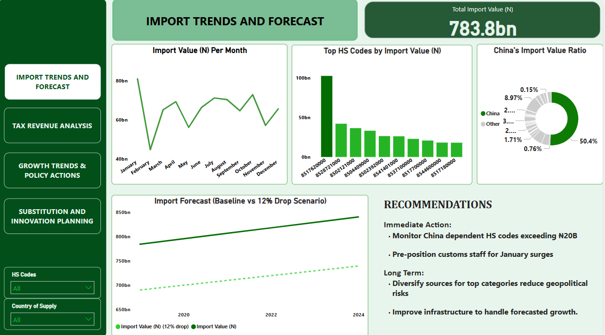

# Import Reforms Dashboard – Team Ruby

This directory contains the final interactive dashboard files developed for the **"Driving Strategic Import Reforms through Advanced Analytics"** hackathon project.

## 📂 Files

1. **Import_Reforms_Dashboard_Team_Ruby.pptx**  
   - An interactive PowerPoint file with the embedded Power BI dashboard.  
   - ⚠️ *Best viewed using Microsoft Office 2024 or later*.  
   - **To use:**
     - Download the file.
     - Enable editing.
     - Wait a few seconds for the embedded dashboard to load.
     - Interact using slicers and navigation elements.

2. **Import_Reforms_Team_Ruby.pbix**  
   - The original Power BI dashboard file.
   - Open in Power BI Desktop to explore, edit, or republish the dashboard.

## 🖼️ Dashboard Images (Static View)

  
  

## Notes

- Dashboard visualizations were built from datasets exported from our analysis notebook (see `/reports`, `/notebooks`).
- Core themes: import and growth analysis, substitution potential, tax gap insights, and strategic recommendations.

[Power BI Report](https://app.powerbi.com/groups/me/reports/f7a8e3ad-c10f-48e2-a712-3103eb691ed8/4ca8491eab339994a331?ctid=66b3f0c2-8bc6-451e-9603-986f618ae682&experience=power-bi)
---

